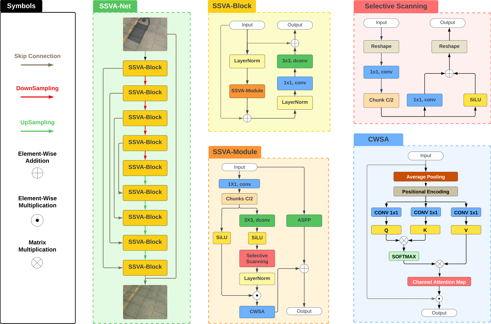
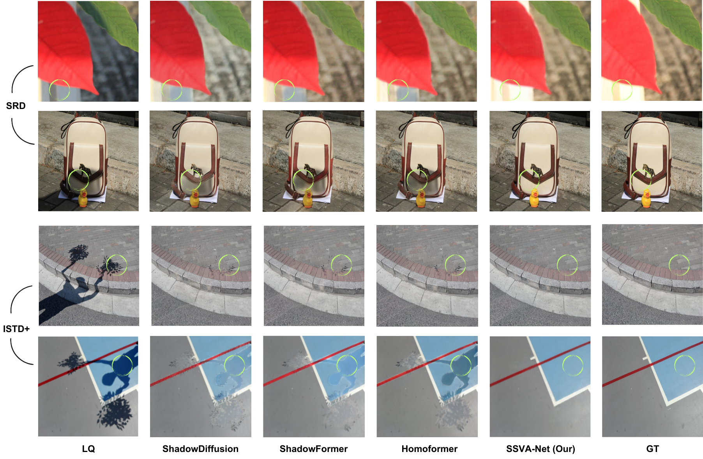

# SSVA: Self-Scanned Visual Attention for Enhanced Mask-Free Shadow Removal

This repository contains the official PyTorch implementation of **SSVA-Net**, a novel mask-free shadow removal framework submitted to CVPR 2025.

---

## Abstract

Shadows in natural images degrade visual quality and impact computer vision tasks. Existing mask-free shadow removal methods often fail to achieve the precision of mask-based approaches due to the absence of explicit shadow masks. To address this, we propose **Self-Scanned Visual Attention (SSVA)**, which integrates:

1. **Selective Scanning Component (SS)** - Inspired by Vision Mamba architectures, normalizing shadow variations spatially.
2. **Channel-Wise Self-Attention (CWSA)** - Inspired by Vision Transformers, refining global dependencies across channels.
3. **Light Normalization Loss (LNL)** - which improves structural fidelity and perceptual quality by normalizing illumination across shadows without explicit shadow masks..

These mechanisms are combined into the **SSVA Module (SSVA-M)** and embedded into a UNet-based framework as **SSVA Blocks (SSVA-B)**, resulting in the **SSVA-Net** architecture. Extensive evaluations on benchmark datasets demonstrate that SSVA-Net:

- Achieves state-of-the-art results in mask-free shadow removal, with:
  - **~5.9% PSNR improvement**
  - **~15.7% RMSE reduction**
- Outperforms top-performing mask-based methods with:
  - **~2.2% PSNR gain**
  - **~1.6% RMSE reduction**

SSVA-Net is designed to dynamically adapt to diverse shadow patterns, making it a robust and efficient solution for shadow removal.

---

## Key Features

- **Mask-Free Framework**: Eliminates the need for manually annotated shadow masks.
- **Attention Mechanisms**: Integrates spatial (SS) and channel-wise (CWSA) attention.
- **State-of-the-Art Results**: Surpasses existing methods on ISTD+ and SRD datasets.
- **Custom Loss Function**: Employs Light Normalization Loss for better perceptual quality.
- **Transparency in Results**: All results are based on strict benchmarking protocols with accessible training and testing resources.


*Figure 1: Overview of the SSVA-Net Architecture.*


*Figure 2: Qualitative comparison of shadow removal results.*

---


## Results and Pre-Trained Models

### Results for 256×256 Resolution

| **Dataset** | **RMSE** | **PSNR** | **SSIM** | **LPIPS** | **Model Variation** | **Results Link** | **Model Link** |
|-------------|----------|----------|----------|-----------|---------------------|------------------|----------------|
| SRD         | 3.84     | 25.91    | 0.642    | 0.439     | SSVA-Net           | [Results](https://drive.google.com/drive/folders/1Fh0lnoX7BH-Qvrpx11mAHNhg6f6esAGd?usp=drive_link)     | [Download](https://drive.google.com/drive/folders/1lR4vSuOb1LOpNqmGYJFs7WaCe2e-bzwr?usp=drive_link)  |
| SRD         | 3.86     | 25.94    | 0.666    | 0.422     | SSVA-Net+          | [Results](https://drive.google.com/drive/folders/1Fh0lnoX7BH-Qvrpx11mAHNhg6f6esAGd?usp=drive_link)     | [Download](https://drive.google.com/drive/folders/1lR4vSuOb1LOpNqmGYJFs7WaCe2e-bzwr?usp=drive_link)  |
| ISTD+       | 3.18     | 27.45    | 0.710    | 0.390     | SSVA-Net           | [Results](https://drive.google.com/drive/folders/18iSfkhyRya0YEMHUbpkn6pcxR-MNaoHS?usp=drive_link)     | [Download](https://drive.google.com/drive/folders/1eukh2JSvSdok0AknK-JCJAjbRX89hzIh?usp=drive_link)  |
| ISTD+       | 3.11     | 27.15    | 0.741    | 0.347     | SSVA-Net+          | [Results](https://drive.google.com/drive/folders/18iSfkhyRya0YEMHUbpkn6pcxR-MNaoHS?usp=drive_link)     | [Download](https://drive.google.com/drive/folders/1eukh2JSvSdok0AknK-JCJAjbRX89hzIh?usp=drive_link)  |
---
### Results for 512×512 Resolution

| **Dataset** | **RMSE** | **PSNR** | **SSIM** | **LPIPS** | **Model Variation** | **Results Link** | **Model Link** |
|-------------|----------|----------|----------|-----------|---------------------|------------------|----------------|
| SRD         | 3.10     | 28.16    | 0.790    | 0.279     | SSVA-Net           | [Results](https://drive.google.com/drive/folders/1Fh0lnoX7BH-Qvrpx11mAHNhg6f6esAGd?usp=drive_link)     | [Download](https://drive.google.com/drive/folders/1lR4vSuOb1LOpNqmGYJFs7WaCe2e-bzwr?usp=drive_link)  |
| SRD         | 3.17     | 28.00    | 0.804    | 0.265     | SSVA-Net+          | [Results](https://drive.google.com/drive/folders/1Fh0lnoX7BH-Qvrpx11mAHNhg6f6esAGd?usp=drive_link)     | [Download](https://drive.google.com/drive/folders/1lR4vSuOb1LOpNqmGYJFs7WaCe2e-bzwr?usp=drive_link)  |
| ISTD+       | 2.63     | 29.73    | 0.854    | 0.207     | SSVA-Net           | [Results](https://drive.google.com/drive/folders/18iSfkhyRya0YEMHUbpkn6pcxR-MNaoHS?usp=drive_link)     | [Download](https://drive.google.com/drive/folders/1eukh2JSvSdok0AknK-JCJAjbRX89hzIh?usp=drive_link)  |
| ISTD+       | 2.61     | 29.35    | 0.884    | 0.158     | SSVA-Net+          | [Results](https://drive.google.com/drive/folders/18iSfkhyRya0YEMHUbpkn6pcxR-MNaoHS?usp=drive_link)     | [Download](https://drive.google.com/drive/folders/1eukh2JSvSdok0AknK-JCJAjbRX89hzIh?usp=drive_link)  |

---


## Benchmarking Protocol

To ensure a fair comparison with state-of-the-art methods, we strictly adhere to the most recent benchmarking protocol established by Hu et al. [Unveiling Deep Shadows Survey](https://github.com/xw-hu/Unveiling-Deep-Shadows). This protocol provides a standardized framework for evaluating shadow removal methods, ensuring consistency and reproducibility in reported results.

### Evaluation Script

We utilize the official evaluation script provided in the repository:
- [eval_ShadowRemoval.py](https://github.com/xw-hu/Unveiling-Deep-Shadows/blob/main/eval_ShadowRemoval.py)

This script computes the following performance metrics:

- **PSNR (Peak Signal-to-Noise Ratio)**: Measures the quality of the shadow-free image.
- **SSIM (Structural Similarity Index Measure)**: Evaluates the structural similarity between the predicted and ground-truth images.
- **RMSE (Root Mean Squared Error)**: Quantifies the pixel-level error between the predicted and ground-truth images.
- **LPIPS (Learned Perceptual Image Patch Similarity)**: Assesses perceptual similarity between images using deep learning-based features.

By incorporating these metrics, our results are directly comparable with the methods reviewed by Hu et al., ensuring reliability and alignment with the latest advancements in shadow removal research.

---

## Code Structure

The project is organized into the following directories and files:
```bash
MY_PROJECT_SSVANET/
├── configs/
│   └── config.yaml             # Configuration file for training, testing, and evaluation.
├── data/
│   ├── __init__.py             # Initialization for the data module.
│   └── datasets.py             # Contains dataset loaders and preprocessing functions.
├── figures/
│   ├── Arch.png                # Architecture diagram of the model.
│   ├── Qualitative.png         # Qualitative results figure.
│   └── Quantitative.png        # Quantitative results figure.
├── losses/
│   ├── __init__.py             # Initialization for the losses module.
│   └── losses.py               # Custom loss functions for the model.
├── models/
│   ├── __init__.py             # Initialization for the models module.
│   └── SSVANet.py              # Implementation of the SSVANet architecture.
├── Results/
│   └── (output files)          # Directory for storing output results.
├── utils/
│   ├── __init__.py             # Initialization for the utilities module.
│   └── utils.py                # Utility functions used across the project.
├── weights/
│   └── (model weights)         # Directory for storing pre-trained model weights.
├── evaluate.py                 # Script for evaluating the model on test data.
├── README.md                   # Documentation and usage instructions for the project.
├── requirements.txt            # Python dependencies required for the project.
├── test.py                     # Script for testing the model.
└── train.py                    # Script for training the model.
```


### Key Components:
1. **configs/**: Contains the `config.yaml` file used for setting paths, hyperparameters, and other configurations.
2. **data/**: Handles dataset loading and preprocessing through the `datasets.py` file.
3. **figures/**: Stores diagrams and result visualizations (e.g., architecture, qualitative, and quantitative results).
4. **losses/**: Defines custom loss functions used during training.
5. **models/**: Implements the SSVANet architecture in `SSVANet.py`.
6. **Results/**: A directory for storing the output results of the model.
7. **utils/**: Provides utility functions to support the project, such as file handling and metrics calculation.
8. **weights/**: A placeholder for storing pre-trained model weights.
9. **Scripts**:
   - `train.py`: Used for training the SSVANet model.
   - `test.py`: Used for testing the model with provided weights.
   - `evaluate.py`: Evaluates the model and generates quantitative metrics.
10. **Additional Files**:
    - `README.md`: Contains the project documentation.
    - `requirements.txt`: Lists all dependencies required to run the project.

This structure ensures modularity and ease of navigation, allowing efficient development, debugging, and usage of the codebase.

---


## Installation

To install the required packages, run the following commands:

```bash
conda create --name myenv python=3.9
pip install -r requirements.txt
```
## Download

The pre-trained weights and results of the SSVANet model are available for download for two datasets, ISTD+ and SRD, at different resolutions (256 and 512). These resources can be accessed using the following links:

- **ISTD+**: [Google Drive Link](https://drive.google.com/drive/folders/1C2KMeXL4k5gKBaulv6eUIDkuUMY1FVaN?usp=drive_link)
- **SRD**: [Google Drive Link](https://drive.google.com/drive/folders/1Y-BDpgtCh5tjKWfrQClcdPfMveO5NcKe?usp=drive_link)

These resources include the trained model weights and output results for the respective datasets, enabling reproducibility and further exploration of the SSVANet architecture's performance.

---

## Usage


### Training

- Update the `config.yaml` file with the dataset paths.
- Update the `config.yaml` file with the `train_gt_dir` paths.
- Update the `config.yaml` file with the `train_lq_dir` paths.
- Update the `config.yaml` file with the `val_gt_dir` paths.
- Update the `config.yaml` file with the `val_lq_dir` paths.
- Run the following command:

```bash
python train.py
```
---
### Testing

- Update the `config.yaml` file with the `test_lq_dir` paths.
- Update the `config.yaml` file with the `output_dir` paths.
- Set the `weights_path` in `config.yaml` to the correct path for the weights.


- Run the following command:

```bash
python test.py
```
---
### Evaluation

The evaluation process involves configuring the necessary paths and running the evaluation script. The steps are outlined as follows:

1. Update the `config.yaml` file with the paths for the evaluation results, ensuring accuracy and alignment with the directory structure.

2. Specify the path to the ground truth images by setting the parameter `val_gt_dir` in the `config.yaml` file. The correct configuration for this parameter is illustrated in the figure above.

3. Define the output directory for the predicted images by updating the `output_dir` field in the `config.yaml` file. Refer to the figure above for an example of the proper setup.

4. Execute the evaluation script using the following command:

   ```bash
   python evaluate.py
   ```

---
